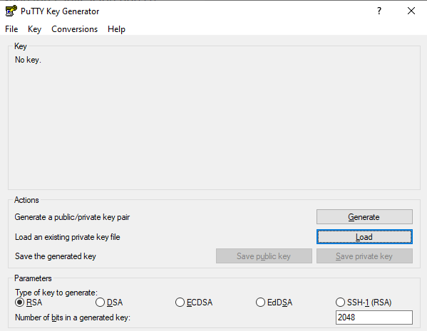
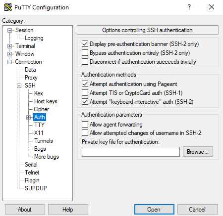
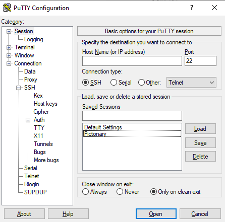
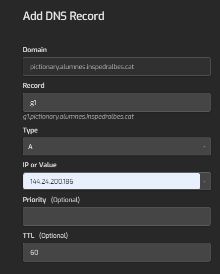
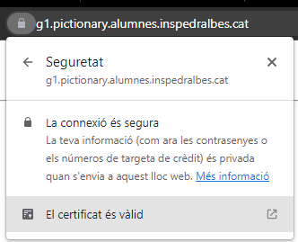
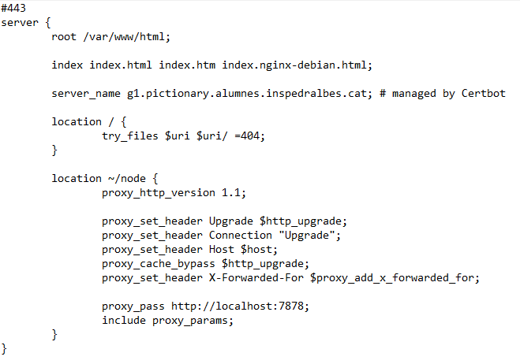

# Documentació bàsica del projecte

<h2>Alguns dels punts que han de quedar explicats:</h2>

<h3> Objectius</h3>

<h3> Arquitectura bàsica</h3>

- Tecnologies utilitzades

- Interrelació entre els diversos components

<h3> Com crees l'entorn de desenvolupament</h3>

<h3>Com desplegues l'aplicació a producció</h3>

-  **Oracle**

	- Una vegada que tinguem la màquina virtual creada en oracle, tenim l'usuari que creguem en la màquina virtual, la IP pública i el certificat SSH.

	- Llavors generem la clau privada, per a això, executem l'aplicació PuTTYgen (una aplicació que s'instal·la automàticament quan instal·lem el Putty).    

	- Una vegada executat el PuTTYgen, li donem a *Load* i triem el certificat ssh. Llavors li donem el botó de *Save private key* i ho guardem.

	- Ja tenim tot el necessari per a poder entrar en la màquina virtual d'Oracle.
-  **Configuració PuTTY**
	- Per la configuració de Putty, entrem en això, ens dirigim **Connection ---> SSH ---> Auth**     
	- Llavors li donem el botó de *Browse* i triem la clau privada que hem generat de PuTTYgen. Seguidament, ens dirigim a **Session** i posem la IP.
	- [Opcional]* Si volem guardar la màquina per sempre i no realitzar tots els passos previs cada vegada que volem entrar, podem guardar totes les configuracions, Posant en una identificacion en **Saved sessions** i li donem **Save**.
	- En el meu cas, el tinc guardat com **Pictionary** i per a accedir en la màquina li dono doble clic en Pictionary i entrem.   
	- I en usuari posem **ubuntu** que el nostre usuari d'ubuntu.
-  **Labs.inspedralbes.cat**
	- Creem un domini (WEB) en labs i juntament amb el DNS -> Entrem en el DNS i afegim un altre record cliquen en el botó de suma que veiem en la fotografia.  
	- Quan li donem el botó ens apareixerà com imatge de sota i ficarem les dades que apareixen en la fotografia. ¿Per què ho fem això? Perquè volem que el domini que, en aquest cas <a  href="https://g1.pictionary.alumnes.inspedralbes.cat/">g1.pictionary.alumnes.inspedralbes.cat</a>, volem que ataqui directament nostra IP del servidor.    
	- Per tant, una vegada que ja tenim la configuració feta en labs anirem cap a oracle.

-  **Instal·lació de Web services en Ubuntu server**
	- Entrem en nostra màquina virtual que tenim desplegat en Oracle.
	- Fer actualitzacions en ubuntu **sudo apt update** & **sudo apt upgrade**
	- Per publicar la nostra aplicació web necesitarem un servei web com en aquest cas seria Nginx i altres serveis (MYSQL, PHP). Per allà seguim els passos de <a  href="https://www.digitalocean.com/community/tutorials/how-to-install-linux-nginx-mysql-php-lemp-stack-on-ubuntu-20-04">DigitalOcean</a>
 
-  **HTTP a HTTPS**
	- Per posar-hi un certificat i passar de http a https, en cas NGINX, seguirem els següents passos.
		- sudo snap install core; sudo snap refresh core
	    - sudo snap install --classic certbot
	    - sudo ln -s /snap/bin/certbot /usr/bin/certbot
	    - sudo certbot --nginx
		    >En aquest pas ens demanarà diferents informacions. 
		    En primer lloc, ens demana el correu  electrònic, en segon lloc, ens farà dues preguntes que li respondrem amb un **yes**. I l'últim lloc ens demanaran  l'enllaç on volem ficar el certificat..
		    
	- I així ja tenim el https.    

- **Importar Projecte**
	- Hem d'importar el projecte de github a nostra màquina virtual. Per tenir-ho ben separat, hem creat una carpeta archivos en la **/var/www/** i farem clone del branch release.
		> 1. cd /var/www
		> 2. sudo mkdir archivos
		> 3. cd archivos
		> 4. sudo git clone -b release "https://github.com/inspedralbes/transversal-3-pictionary-pictionary-grup1.git"
		
	- A continuació, entrem en la carpeta de projecte ---> front i install tots els paquets que te node 
		> 5. sudo npm install
		
	- I finalment, esborrem tot el contingut de /var/www/html/, fem build en front i portem tot el contingut que tenim en la carpeta build a carpeta html 
		>6. sudo cd /var/www/archivos/transversal-3-pictionary-pictionary-grup1/front
		>7. sudo npm run build
		>8. sudo rm -r /var/www/html/*
		>9. sudo cp -r  /var/www/archivos/transversal-3-pictionary-pictionary-grup1/front/build/* /var/www/html
		
	- Per fer la probar que tot esta funcionant correctament, validem que l'estat de nginx estigui funcionan correctament i també fem restart el serveis de Nginx. 
		> 10. sudo  nginx -t
		> 11. sudo systemctl restart nginx
		
- **Configuració Proxy invers(Node) & Node**
	- Primer de tot, afegim el proxy invers en l'arxiu de Nginx (default) per poder accedir en node de manera segura.  
	- En un principi, tenim el primer *location /* i a continuació ficarem el segon *location /node* per conseguir entrar en node atraves de ruta i el proxy invers s'encarregaraà de ubicar-nos fins el port que executant el node que en aquest cas tenim :7878.
		> location ~/node {
            proxy_http_version 1.1;
			proxy_set_header Upgrade $http_upgrade;
        	proxy_set_header Connection "Upgrade";
            proxy_set_header Host $host;
            proxy_cache_bypass $http_upgrade;
			proxy_set_header X-Forwarded-For $proxy_add_x_forwarded_for;
			proxy_pass http://localhost:7878;
            include proxy_params;
        }
		
	- I finalment, instal·lem tots els paquets que te nodejs
		> 1. cd /var/www/archivos/transversal-3-pictionary-pictionary-grup1/back/tr3-node/
		> 2. sudo npm install

<h3>Llistat d'endpoints de l'API de backend</h3>
	- Rutes
	- Exemples de JSON de peticó
	- Exemples de JSON de resposta i els seus codis d'estat 200? 404?